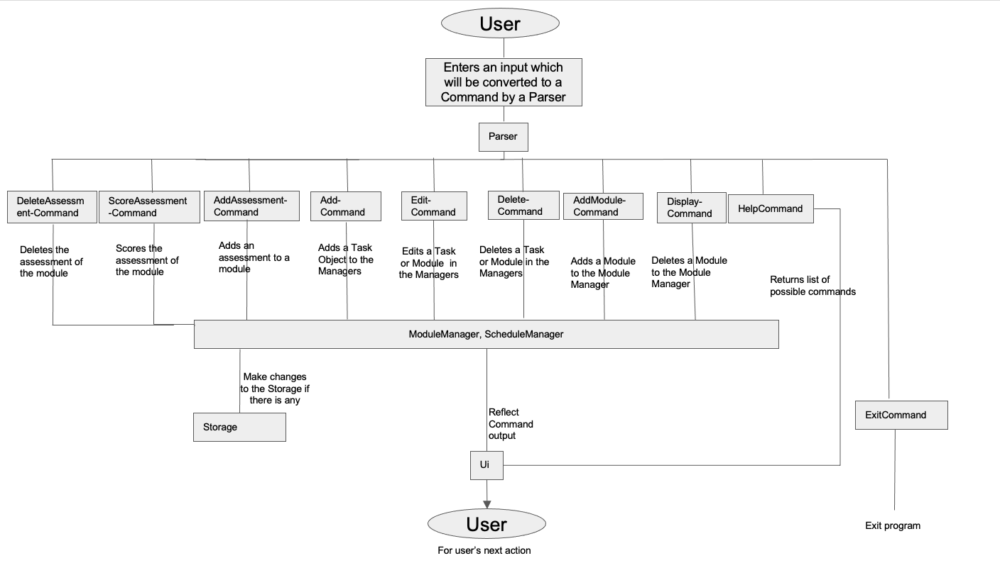
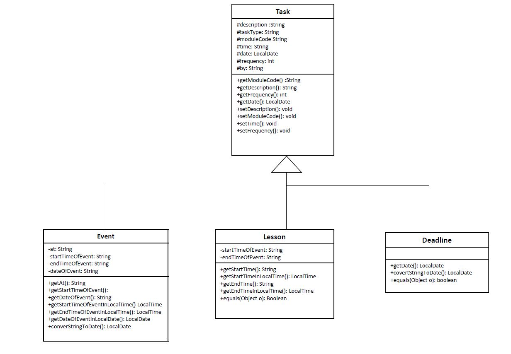
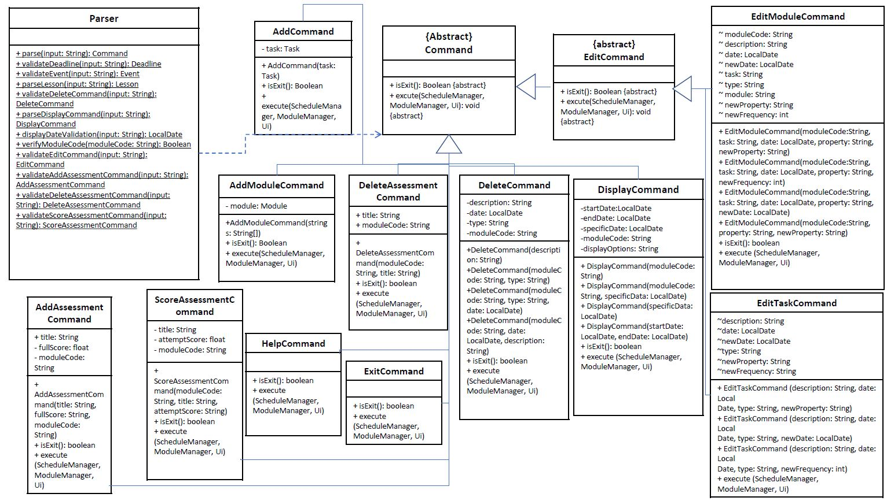
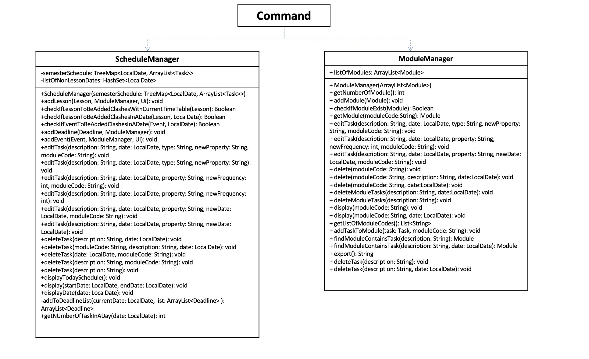
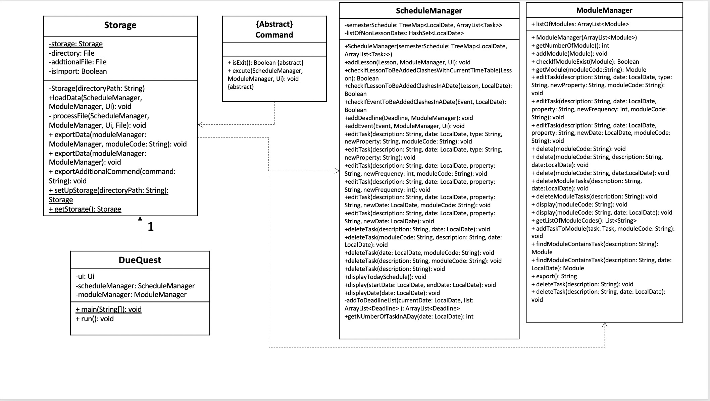
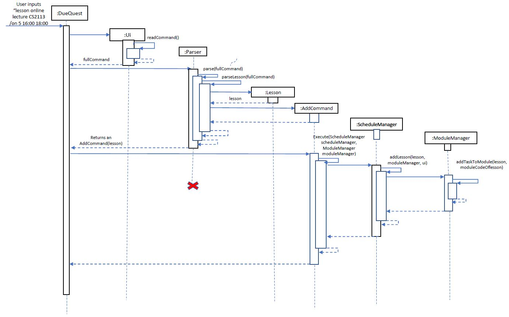
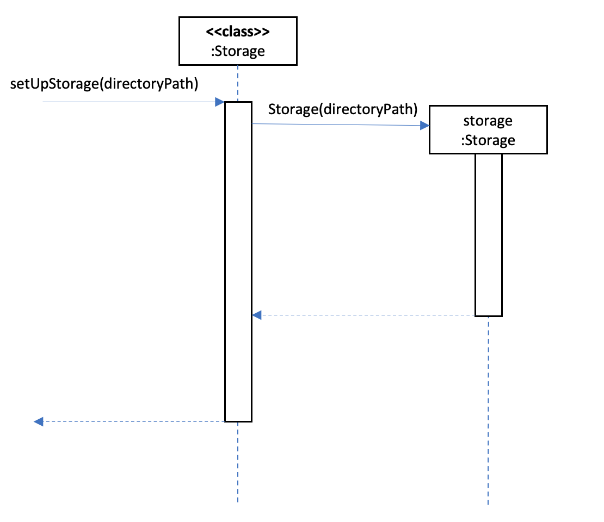
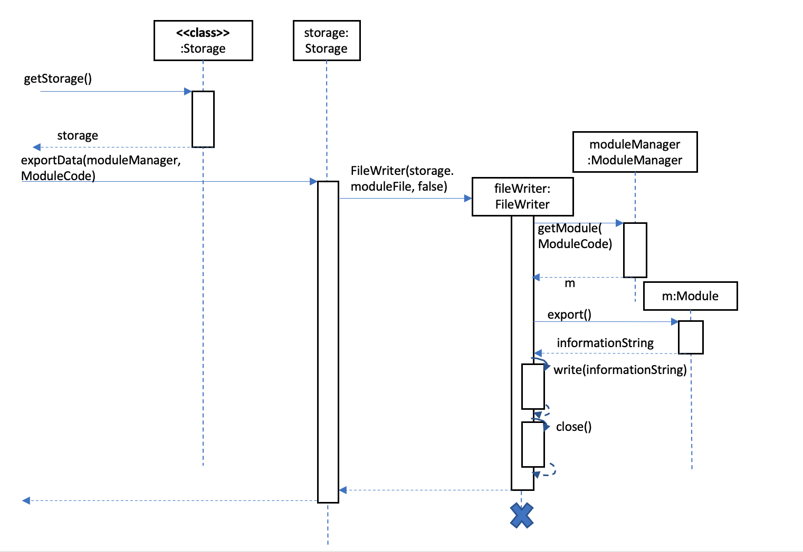
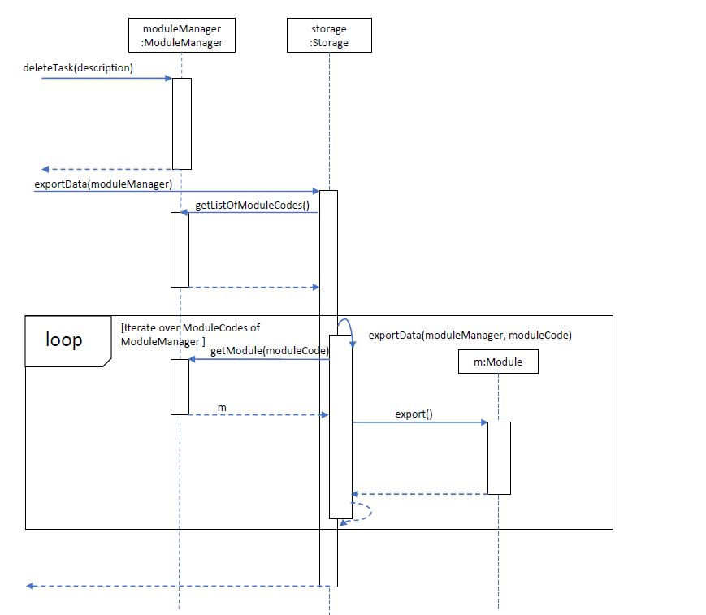
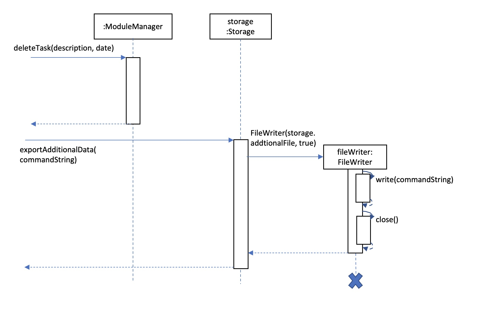

# Developer Guide

## Design & implementation

1. Introduction
    - Welcome to DueQuest
2. Setting Up
    - Prerequisites
    - Setting the project
3. Design
    - Architecture
    - Task Component
    - Command
    - Managers
    - Storage
4. Implementation
    - Adding
    - Display 
    - Storage
    - Edit
    - Delete
5. Documentation
    - Basic Thing to know
    - Style guidance
    - Diagrams
6. Testing
    - Running Tests
    - Types of Tests
7. Product Scope
    - Target User Profile
    - Value Proposition
    - User Stories
8. Glossary

## 1. Introduction

### Welcome to DueQuest

Hello! We appreciate your interest in contributing to DueQuest. DueQuest is an application that
uses a Command Line Interface (CLI) specifically for NUS Students to manage their schedule
during school. This guide is written to give a clearer understanding for developers who are
interested in improving the design and implementation of DueQuest.

## 2.Setting Up

### Prerequisites
- JDK 11
- IntelliJ IDEA
### Setting the project

1. Fork the repo and clone it into your computer
2. Configure the JDK in IntelliJ to ensure it is configured to use JDK11.
3. Click `Import Project` (or `Open or Import` in newer version of Intellij).
4. IntelliJ IDEA by default has the Gradle plugin installed. If you have disabled it, go
to `File → Settings → Plugins` to re-enable them.
5. Locate the build.gradle file (not the root folder as you would do in a normal
importing) and select it. Click `OK` . If asked, choose to `Open as Project` (not `Open as
File` ).
6. Click `OK` to accept the default settings but do ensure that the selected version of
`Gradle JVM` matches the JDK being used for the project.
7. Wait for the importing process to finish (could take a few minutes).

## 3. Design

### Architecture
The diagram below shows a flow chart which gives an overall general picture of how the
application works whenever the application receives an input from the user and a shows how
each component interacts with one another for different scenarios. The logic behind the
application is mostly handled by the `Parser` which converts inputs into various executable
`Command`.

### Task Component
Each `Task` can be a `Lesson`, `Event` or `Deadline`. Below is a UML diagram showing
some of the properties and methods that these classes have. A `Task` will be created
whenever a User wants to add a Task into the `ScheduleManager` or `ModuleManager`.

### Command
The logic of what should be executed whenever the application receives an input will be
handled by parsing these inputs into Commands using a Parser . Below is a UML Diagram
showing how the `Parser` classes and the `Command` classes interact. Unless the `Command` is
an `ExitCommand` or `HelpCommand` , the `Command` will be executed to perform an action to
either the `ScheduleManager` or `ModuleManager` or both.

### Managers
The application consists of two managers, the `ScheduleManager` and `ModuleManager`. The
`ScheduleManager` will handle the storing of `Task` in each day. The `ModuleManager` will
handle storing the task of each `Module`. Below is a UML Diagram showing some of the key
methods and properties of the `ScheduleManager` and `ModuleManager` classes

Some Design Considerations on how to store the `Task` in the `ScheduleManager`:
- Use of a `TreeMap` to store the date as keys and `ArrayList` as values.
    - Pros: Use of a `TreeMap` allows iteration of dates as the key to be iterated in order, which
                might be useful in further development of implementation of the use of the `ScheduleManager`.
                Searching for a date can also be done in O(logn) similarly to a `HashMap`.
    - Cons: Storing the dates that have past and also storing of many dates might be heavy in
                terms of space.
- Use of a `HashMap` to store the date as keys and `ArrayList` as values
    - Pros: Allows tracking of tasks with respect to the dates as keys.
    - Cons: Does Not allow iteration in order as when desired as compared to a `TreeMap`.
- Creation of a new class which contains a schedule for each day, and using a `TreeSet`.
      to contain this new class.
    - Pros: Making use of more oop design.
    - Cons: Might be tricky to implement and may need more resources.
    
### Storage
The application will save all of the user inputs by using a `Storage` class, which is designed as
singleton.

It exports the data in the application and converts it into the form of a txt file. This allows users
to retain their saved data after exiting the app. More elaboration of how this will be done will be shown later, 
where a sequence diagram will show how this process works.

## 4. Implementation

This section describes some noteworthy details on how certain features are
implemented.

### Add Feature

The add implementation allows the user to add a `Lesson`, `Event` or `Deadline`. This is facilitated
by implementing the ScheduleManager and ModuleManager, which stores all of the `Task` in
them. The `ScheduleManager` helps to save these tasks into the dates according to the date of
the `Task` as stated by the User. The `ModuleManager` will also add the `Task` into the respective module
that it belongs to. Below is a sequence diagram which shows how adding of a
`Lesson` works. Adding of a Event or a Deadline is also in a similar fashion.

### Display Feature

For display method, there are 5 possible scenarios that could include parameters such
as `Module` code, date & range of date.
As seen from the diagram, the 5 Scenarios are:
1. Display today Schedule
2. Display all information in a specific module
3. Display all task in a specific module on a specific date
4. Display all task within a range of dates
5. Display all task on a specific date

Example: flow for Displaying today schedule:
1. The user will run the app and type in “display”, which will then be received by the `Ui` and
it returns the input as a String fullCommand
2. The String fullCommand will then be parsed by a `Parser` to return an `DisplayCommand`
object.
3. The DisplayCommand object will then be executed to display today’s Schedule using the
`ScheduleManager.displayToday()` method

### Storage Feature

1. Set up the `Storage` from local disk 

2. Add/Edit Module
When modules’ information is changed (e.g. add, delete), the changed module’s code
will be passed to storage. `Storage` will export the new information of the changed `Module` 
to the corresponding local files.

3. Record Delete Action

There are two types of deleting:
- Delete all elements
    
    Once some tasks are deleted, the `ModuleManager` is updated. Storage will exported
    the new content of `ModuleManager`.
    
- Delete the element only on that date
    
    The command of deleting is passed to `Storage`, and `Storage` will write this `Command`
    to `AdditionalFile`, so that whenever importing files, this `DeleteCommand` will be
    executed again from `AdditionalFile`.

### Edit Feature

The `editCommand` base class forms the basis for the two extensions listed below.

1. Edit Module Command
When the `EditModuleCommand` is executed, it checks for the description of the particular property to 
edit with `scheduleManager` and `moduleManager`.  The constructor function is overloaded such that the 
conditions will check for which property to edit. In the case that there are no module details to modify,
the function execution will go on to check for module tasks to modify.

2. Edit Task Command
When the `EditTaskCommand` is executed, it checks for the description of the particular property to 
edit with `scheduleManager` and `moduleManager`.  The constructor function is overloaded such that the 
conditions will check for which property to edit.

### Delete Feature

The `deleteCommand` is the class which oversees the deletion of modules and tasks.

1. The `deleteCommand` class is overloaded such that the conditions of the deletion are checked. The 
`scheduleManager` and `moduleManager` both manage their deletions separately, overloading the deletions
where necessary.

## 5. Documentation

This Section describes how to write documentation for the project. The projects is
written in GitHub-Flavoured Markdown

### Basic Thing to know
- The docs/ folder is used to store documentation file

### Style guidance
- Google developer Documentation style guide
- [se-edu/guides] Markdown coding standards

### Diagrams
- Draw.io ( free )

## Testing

## 6. Running Tests

### Running Tests
There are two ways to run tests
1. Using IntelliJ JUnit Test Runner
    1. To run all the test, right click on the src/test/java and choose Run ‘Tests in
tp.test’
    2. To run a subset of test, you can right click on a test package, test class, or a test
and choose run “ScheduleManagerTest”
2. Using Gradle
    1. Open a console and run the command gradlew clean test
    2. For Mac or linux users, use ./gradlew clean test
    
### Types of Tests
For this project, we are using one type of test:
- Unit Test.
- For eg, seedu.duequest.ModuleManagerTest.

## Product scope

### Target user profile

The target user for our app is for NUS Students who hope to have a platform for them to
manage their schedule and work in the school semester

### Value proposition

This app helps NUS Students by keeping on track with their schedule and work on a daily basis,
reducing chances of them forgetting about any work related to school.

### User Stories (to be updated)

|Version| As a ... | I want to ... | So that I can ...|
|--------|----------|---------------|------------------|

## Glossary

* *glossary item* - Definition

